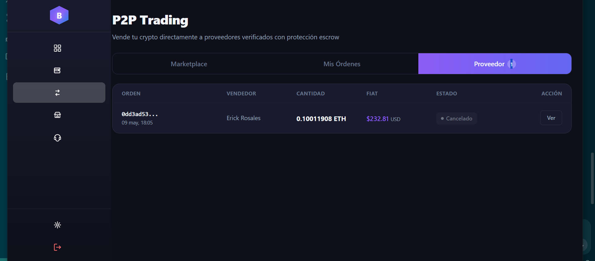
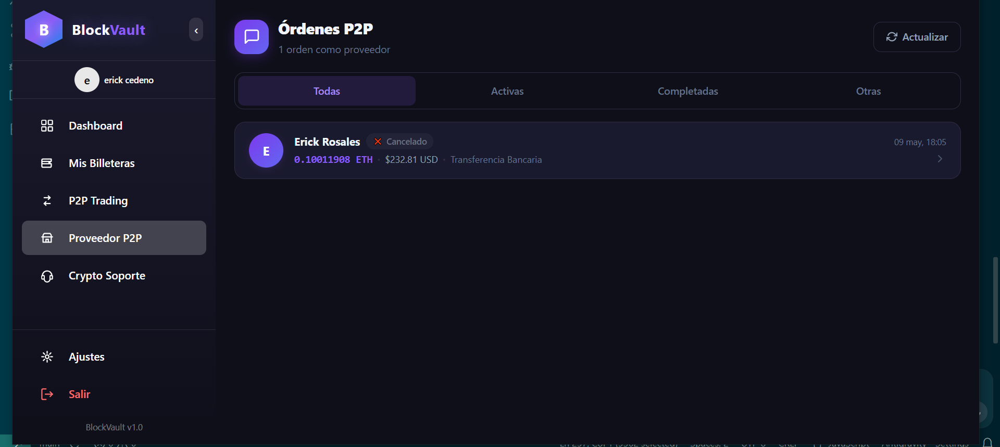
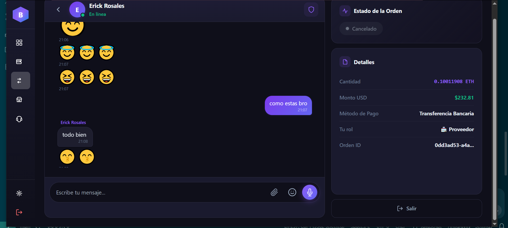

# BlockVault

BlockVault is a comprehensive cryptocurrency wallet platform designed to facilitate secure and efficient transfers across multiple EVM-compatible blockchain networks. Built with modern technologies including NestJS, React, and Hardhat, it enables seamless peer-to-peer (P2P) transactions, multi-chain wallet management, P2P trading, and decentralized escrow operations through smart contracts. The platform features a robust P2P marketplace where users can securely exchange cryptocurrencies directly with built-in chat functionality, order management, and advanced security features including two-factor authentication.

## 🛠️ Technology Stack


# Setup env node

Windows
```
$ set NODE_OPTIONS=--openssl-legacy-provider
```
Linux
```
$ export NODE_OPTIONS=--openssl-legacy-provider
```

# Start frontend
```
$ cd frontend  
$ pnpm install
```
```
$ pnpm start
```
# Install backend dependencies
```
$ cd backend  
$ pnpm install
$ pnpm install -g solc
```

# Start app-core
```
$ cd backend/app-core  
$ pnpm i -g @nestjs/cli  
$ pnpm install
```
```
$ nest start --watch (listening mode)  
$ nest start
```

# Start Daemons and Workers (via Docker)
```
$ docker-compose up backend-daemons-workers
$ docker-compose logs -f backend-daemons-workers
$ docker-compose down
```

# Start all instances with Docker
```
$ docker-compose up  
$ docker-compose down
$ docker-compose up --build -d
$ docker-compose logs -f backend-daemons-workers
```
All services (Redis, MongoDB, Backend, Frontend) will be running in Docker containers.

# Deploy smart contract and generate wallets 
```
$ cd backend/tasks/+
$ pnpm install -g hardhat  
$ hardhat run scripts/deploy.js --network (--network name--)  
$ node generate.js (--number of wallets--) + (--network ID--)
```

# Screenshots  

# Login  
  

# Register  
  

# 2FA Auth  
  

# Dashboard  
  

# Wallets  
  

# Settings  
  

# Transactions  
  

# Transactions History  
  

# Dashboard wallets  


# P2P Trading


# P2P Orders


# P2P Chat
  
