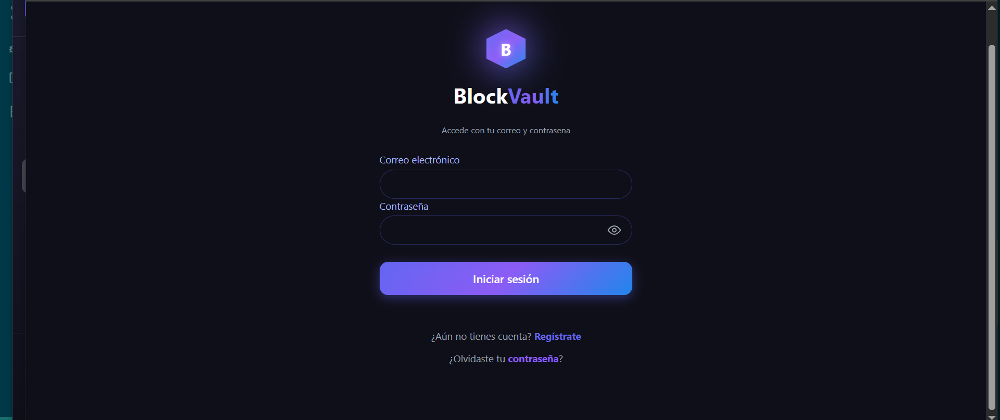
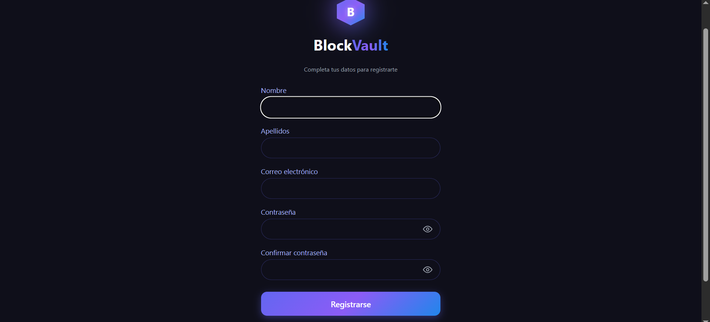
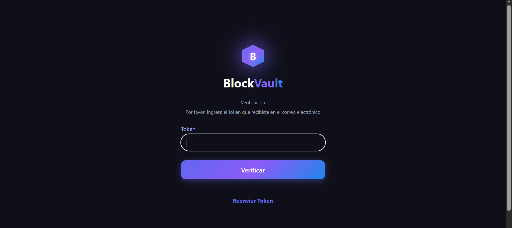
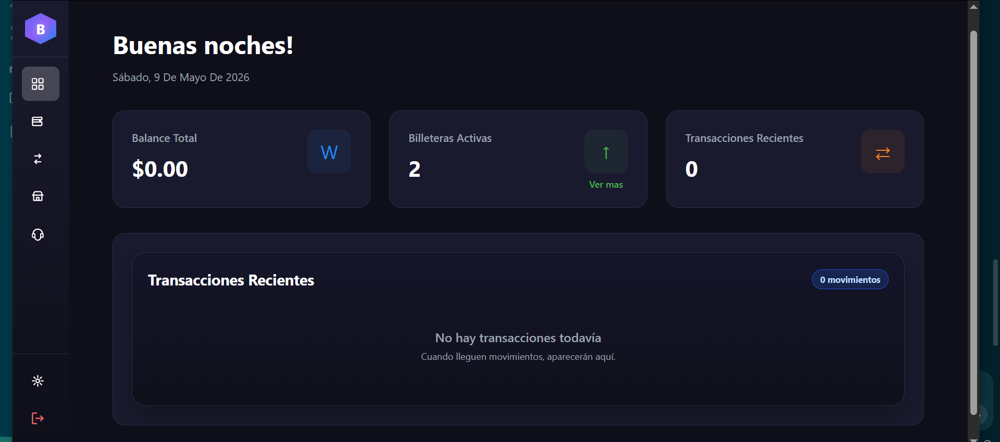
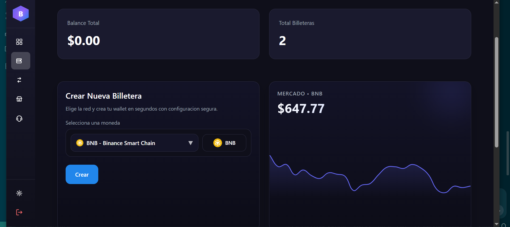
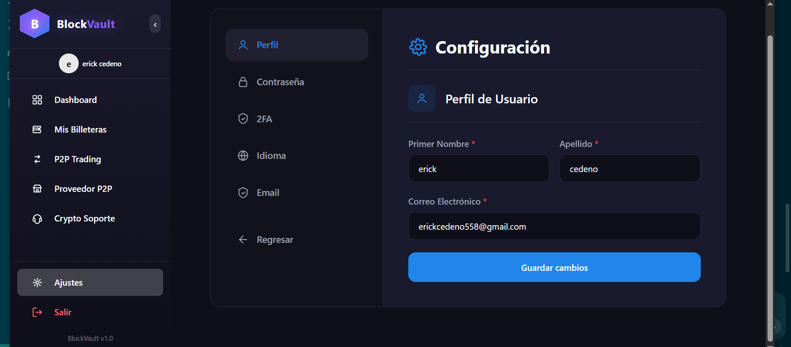
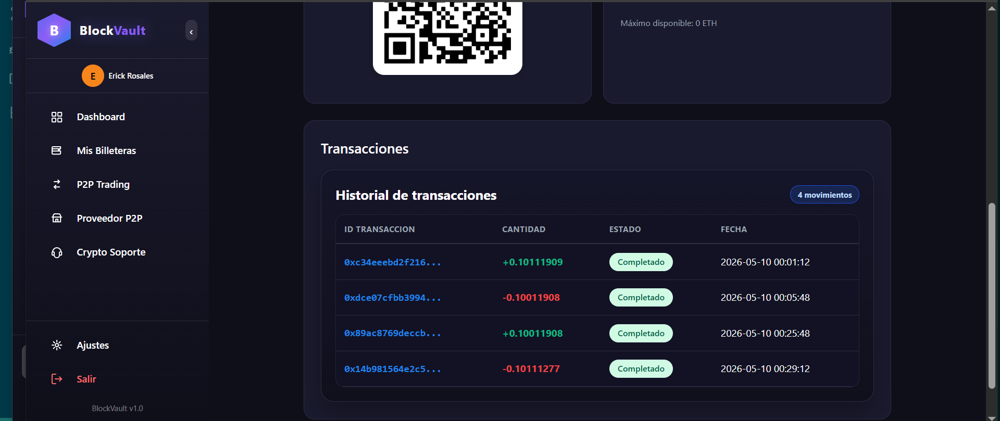
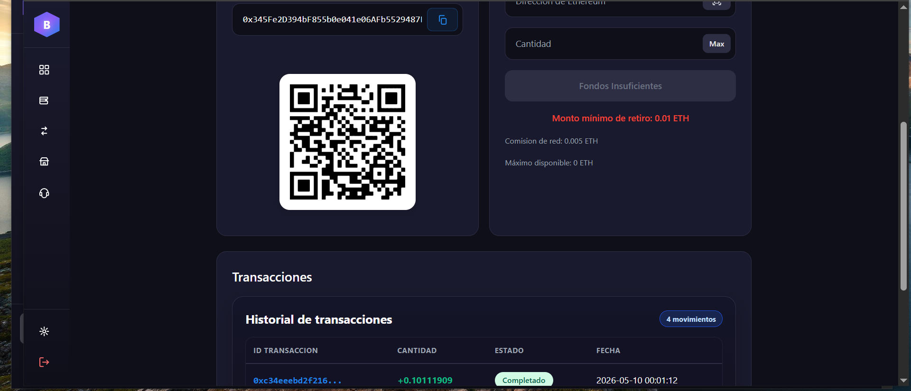
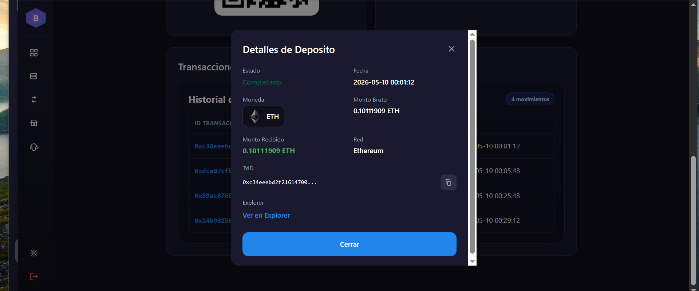

# BlockVault  still in development


## 🛠️ Technology Stack


# Setup env node

Windows
```
$ set NODE_OPTIONS=--openssl-legacy-provider
```
Linux
```
$ export NODE_OPTIONS=--openssl-legacy-provider
```

# Start frontend
```
$ cd frontend  
$ npm install
```
# if error
```
$ npm install --force
```
```
$ npm start
```
# Install backend dependencies
```
$ cd backend  
$ npm install
$ npm install -g pm2  
$ npm install -g solc
```

# Start app-core
```
$ cd backend/app-core  
$ npm i -g @nestjs/cli  
$ npm install
```
# if error 
```
$ npm install --force
$ nest start --watch (listening mode)  
$ nest start
```

# Start Deamons and Workers
```
$ pm2 start process.json  
$ pm2 monit  
$ pm2 stop process.json
```

# start Instances
```
$ docker-compose up  

$docker compose down

$docker compose up --build -d

docker compose logs -f backend-daemons-workers

$ download Redis server  
$ download MongoDB server  
$ redis-server  
$ mongod --port --
```

# Deploy smart contract and generate wallets 
```
$ cd backend/tasks/+
$ npm install -g truffle  
$ truffle deploy --network (--network name--)  
$ node generate.js (--number of wallets--) + (--network ID--)
```

# Screenshots  

# Login  
  

# Register  
  

# 2FA Auth  
  

# Dashboard  
  

# Wallets  
  

# Settings  
  

# Transactions  
  

# Transactions History  
  

# Dashboard wallets  
  
